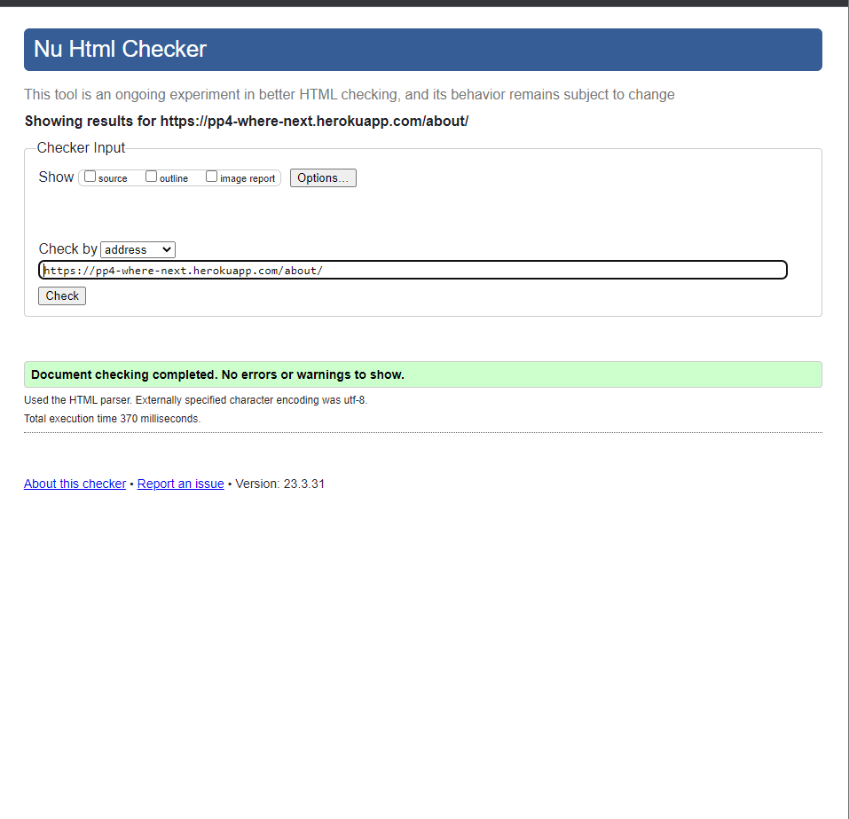
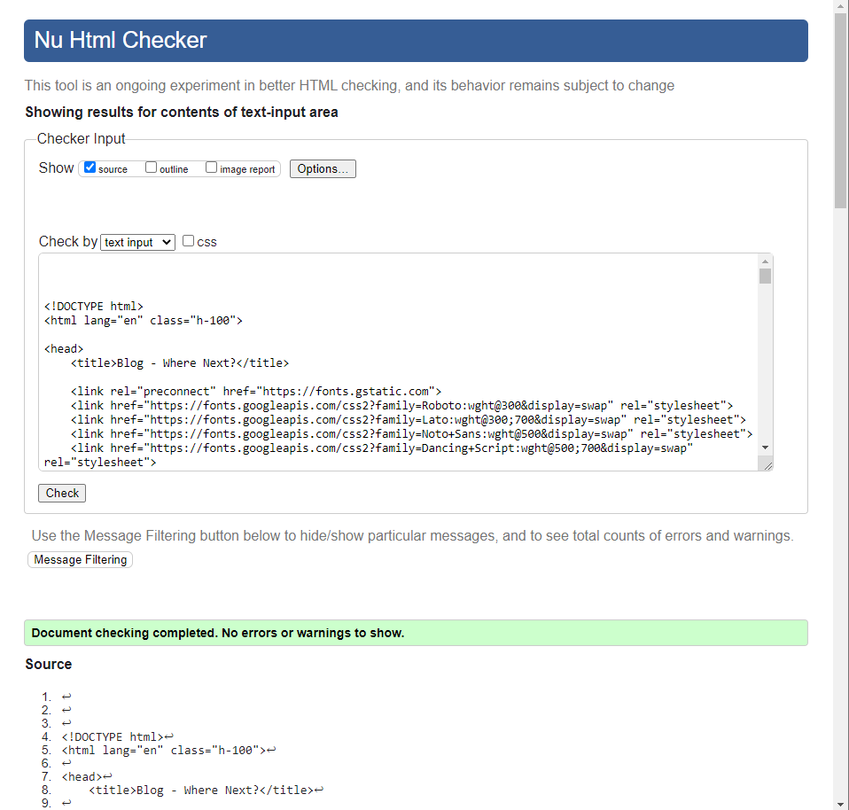
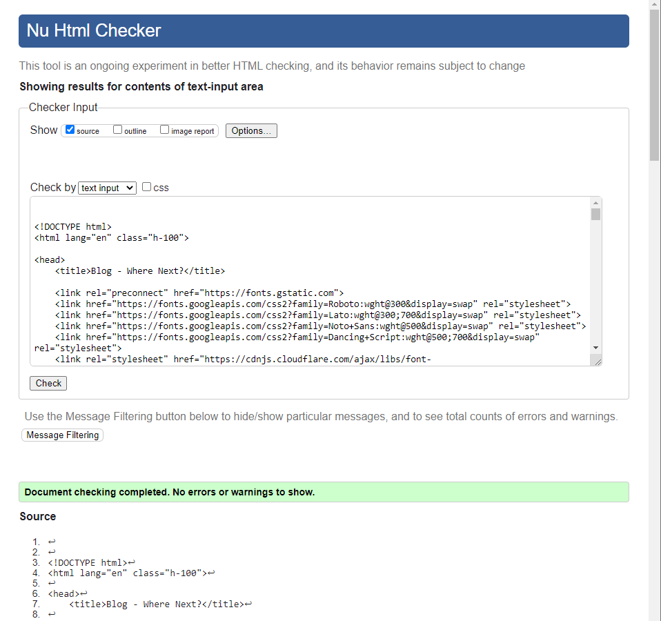
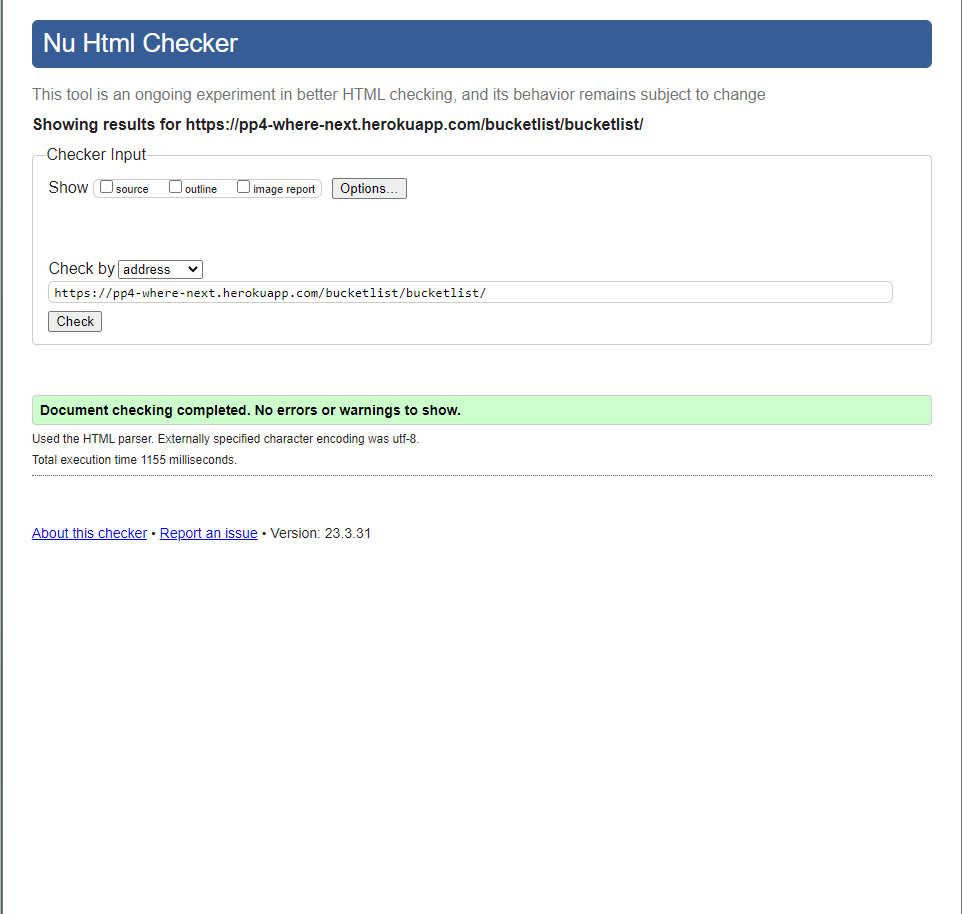
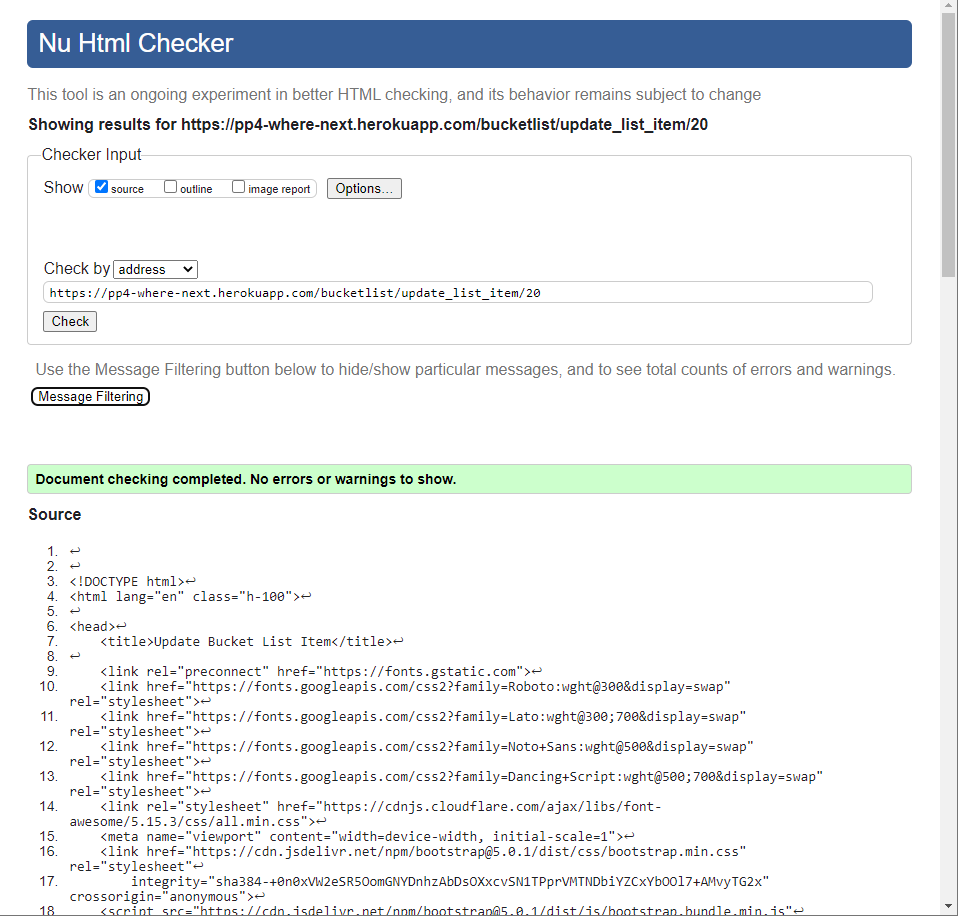
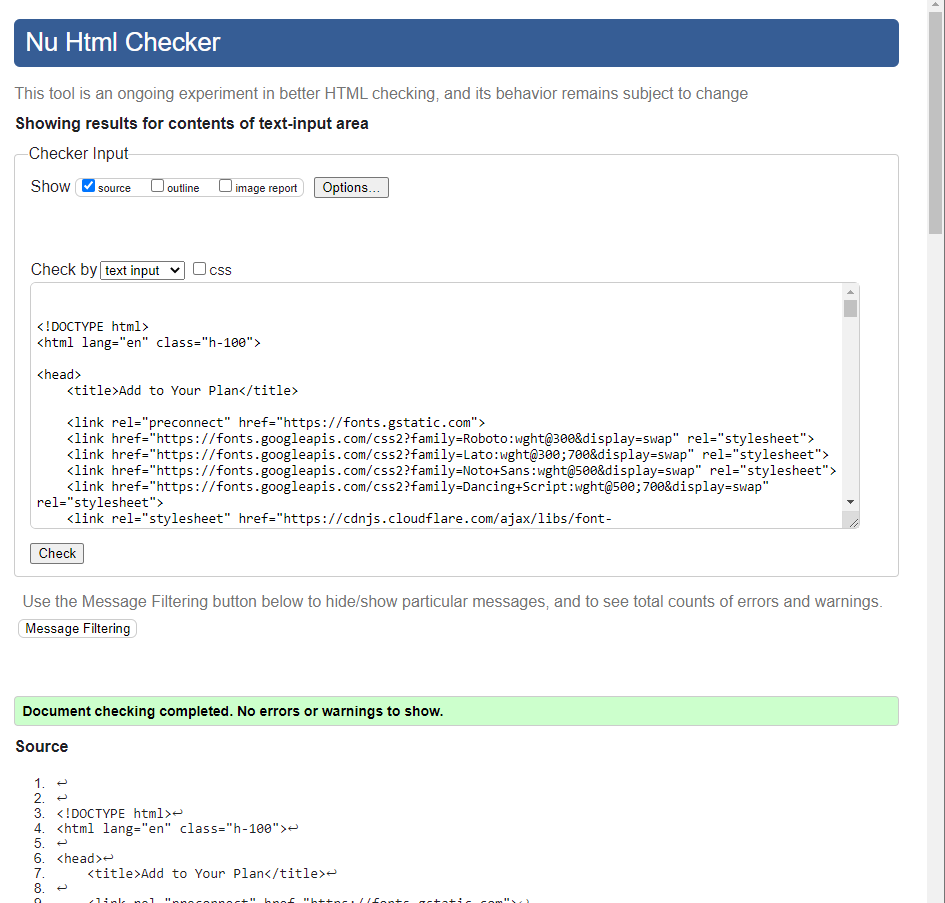
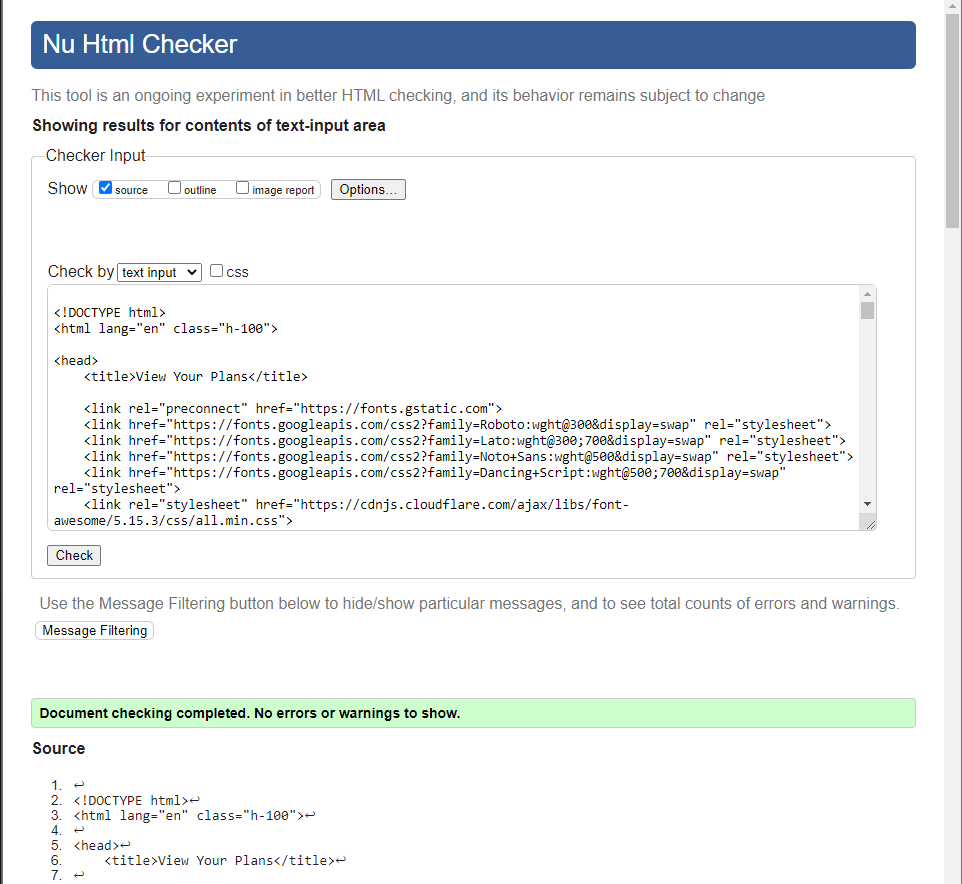
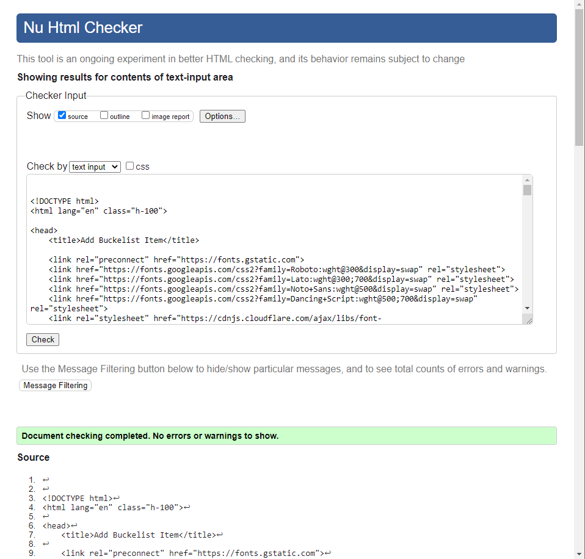
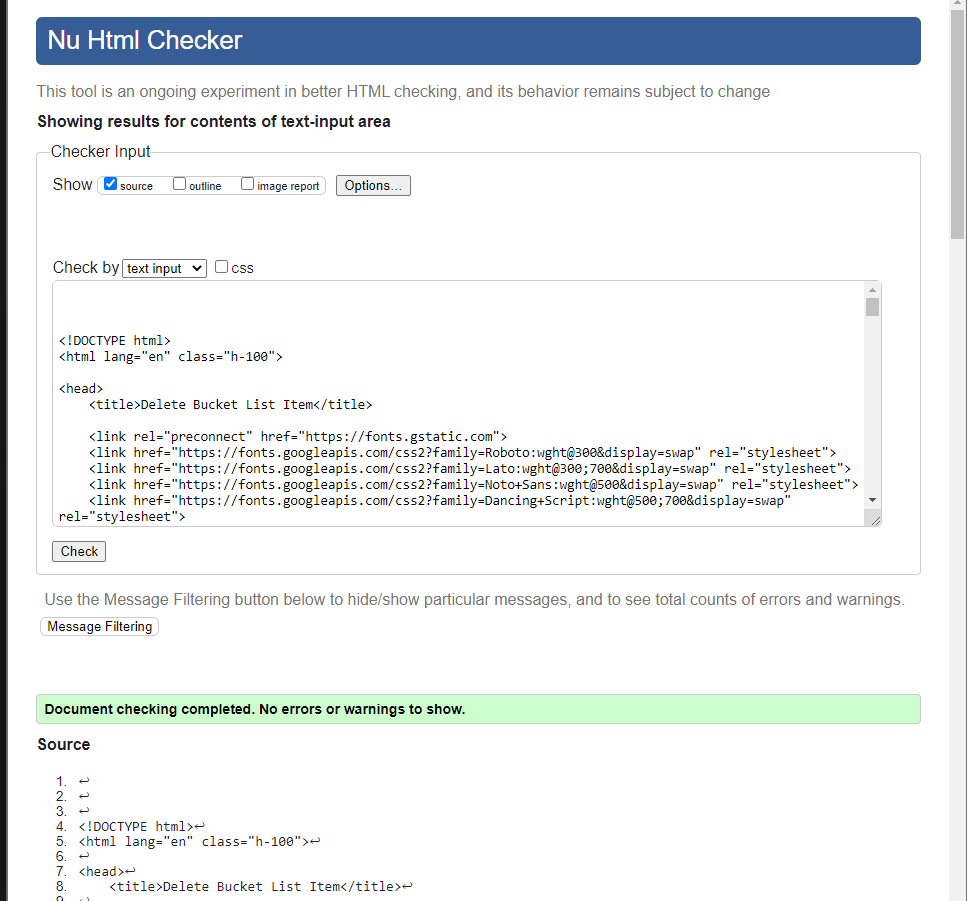
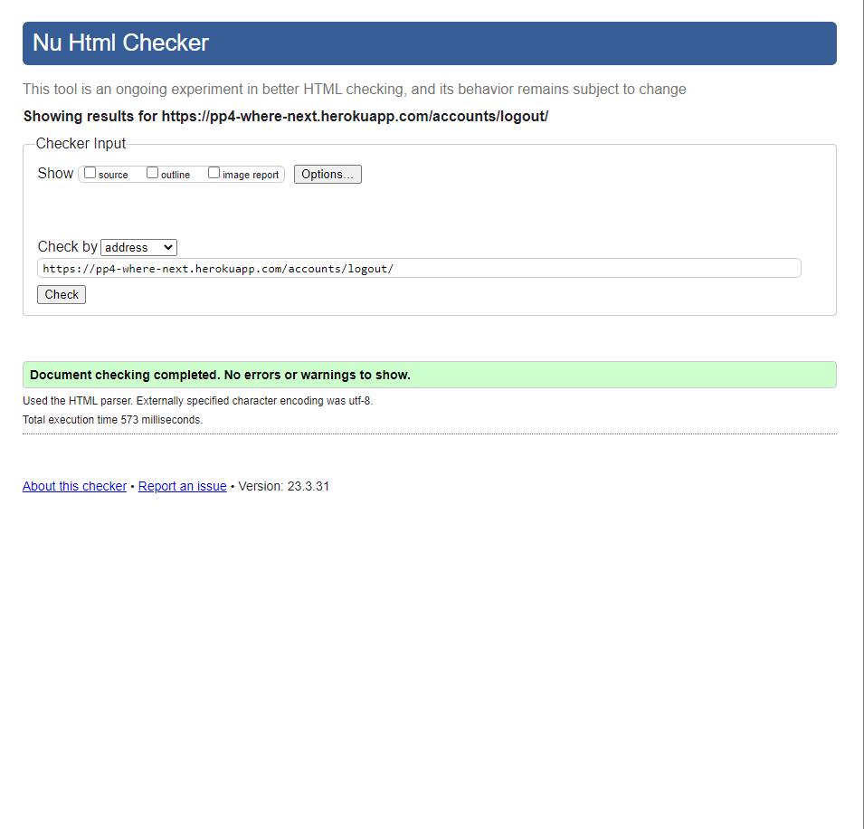

## Testing

Return back to the [README.md](README.md) file.

## Code Validation

### HTML

I have used the recommended [HTML W3C Validator](https://validator.w3.org) to validate all of my HTML files.

As my project uses Jinja syntax, such as ``, ``, and `{{ variable|filter }}`
it will not validate properly if I copy and paste into the HTML validator straight from my source files.

Usually in order to properly validate these types of files, it's recommended to
[validate by uri](https://validator.w3.org/#validate_by_uri) from the deployed Heroku pages.

Unfortunately, nearly all of the pages on this site require a user to be logged-in and authenticated,
and will not work using this method, due to the fact that the HTML Validator (W3C) doesn't have
access to login to the pages.

In order to properly validate my HTML pages with Jinja syntax for authenticated pages, I followed these steps:

- Navigate to the deployed pages which require authentication
- Right-click anywhere on the page, and select **View Page Source** (usually `CTRL+U` or `⌘+U` on Mac).
- This will display the entire "compiled" code, without any Jinja syntax.
- Copy everything, and use the [validate by input](https://validator.w3.org/#validate_by_input) method.
- Repeat this process for every page that requires a user to be logged-in/authenticated.

| Page | W3C URL | Screenshot | Notes |
| --- | --- | --- | --- |
| Home | [W3C](https://validator.w3.org/nu/?doc=https%3A%2F%2Fpp4-where-next.herokuapp.com%2F) |  | Pass: No Errors |
| About | [W3C](https://validator.w3.org/nu/?doc=https%3A%2F%2Fpp4-where-next.herokuapp.com%2Fabout%2F) |  | Pass: No Errors |
| Register | n/a |  | Pass: No Errors |
| Log In | n/a |  | Pass: No Errors |
| Bucket List | n/a |  | Pass: No Errors |
| Edit User | n/a |  | Pass: No Errors |
| Update List Item | n/a |  | Pass: No Errors |
| Update Plan | n/a |  | Pass: No Errors |
| View Plan | n/a |  | Pass: No Errors |
| Add List Item | n/a |  | Pass: No Errors |
| Delete Bucket List item | n/a |  | Pass: No Errors ||
| Sign Out | [W3C](https://validator.w3.org/nu/?doc=https%3A%2F%2Fpp4-where-next.herokuapp.com%2Faccounts%2Flogout%2F) |  | Pass: No Errors |

[Back to top &uarr;](#contents)

### PEP8

- [PEP8CI](https://pep8ci.herokuapp.com/) - This was used test the code. No errors where found in the code. 

| File | folder/app | Screenshot | Notes |
| --- | --- | --- | --- |
| admin.py | Bucketlist |  | No errors found |
| apps.py | Bucketlist |  | No errors found |
| forms.py | Bucketlist |  | No errors found |
| models.py | Bucketlist |  | No errors found |
| urls.py | Bucketlist |  | No errors found |
| views.py | Bucketlist |  | No errors found |
| admin.py | Travelblog |  | No errors found |
| apps.py | Travelblog |  | No errors found |
| models.py | Travelblog |  | No errors found |
| urls.py | Travelblog |  | No errors found |
| views.py | Travelblog |  | No errors found |
| settings.py | wherenext |  | No errors found |
| urls.py | wherenext |  | No errors found |
| wsgi.py | wherenext |  | No errors found |

[Back to top &uarr;](#contents)

### CSS

| CSS | Screenshot | Notes |
| --- | --- | --- |
|  |  | No errors found |

[Back to top &uarr;](#contents)

### Lighthouse

[Back to top &uarr;](#contents)

## Manual Testing

### Navigation Bar
Feature | Action | Expected Result | PASS/FAIL
---|---|---|---
Menu | Display | Links displayed side by side in the navigation bar | PASS
Home Link | Click | Navigates to Home page | PASS
About Link | Click | Navigates to About page | PASS
Log In Link | Click | Navigates to log In page | PASS
Register | Click | Navigates to Sign up page | PASS
Welcome (unauthenticated) | Click | returns home| PASS
Welcome (authenticated) | Click/hover/display | Shows users name, when mouse hovers over changes to say click to edit profile | PASS
Sign Up Link | Display | Only available if the user is not logged in | PASS
Sign Up Link | Click | Navigates to Sign Up page | PASS
Log In Link | Display | Only available if the user is not logged in | PASS
Log In Link | Click | Navigates to Log In page | PASS
Log Out Link | Display | Only available if the user is logged in | PASS
Log Out Link | Click | Navigates to Log Out page and asks user if they're sure they want to log out | PASS
Bucket List | Display | Only available if the user is logged in  | PASS
Bucket List | Click | Navigates to Bucket List page  | PASS
All Links | Hover | Color changes to darker when hover | PASS
All Links | Click | Changes to underline to show which page user is on | PASS

### Blog Posts
Feature | Action | Expected Result | PASS/FAIL
---|---|---|---
Categories | Click | navigates to category page | PASS
Title | Click | navigates to blog post page | PASS
Blog Cards | Display | Display card with date time likes and comments | PASS
Pagination | Display | shows pagination button after 6 posts | PASS
Pagination | Click | navagtes to next page of posts | PASS

### Bucket List
Feature | Action | Expected Result | PASS/FAIL
---|---|---|---
List Items | Display | shows a list of all items for the logged in user only | PASS
Add & Back Buttons | Hover | turns white from blue | Pass
Add button | Click | navigates to add item form | PASS
Back button | Click | navigates to home page | PASS
Button Group | Hover | goes from gray to darker gray | PASS
Edit Button | Click | navigates to edit form | PASS
View Plan | Click | navigates to view plan page | PASS
Update Plan Button | naviagtes to update plan form | PASS
Delete Button | Click | navigates to page to confirm | PASS
Done Item | When item is marked done, a tick appears and is striked through | PASS

### Add Item
Feature | Action | Expected Result | PASS/FAIL
---|---|---|---
Add & Back Buttons | Hover | turns white from blue | Pass
Add button | Click | adds item and returns to bucket list | PASS
Back button | Click | navigates to bucket list page | PASS
Title input | Display | Placeholder in input box | PASS

### Edit Item
Feature | Action | Expected Result | PASS/FAIL
---|---|---|---
Input box | Display | Shows the item in the input box to be amended | PASS
Done box | Display | shows so user can change item to done | PASS
Update & Back Buttons | Hover | turns white from blue | Pass
Update button | Click | update item and returns to bucket list | PASS
Back button | Click | navigates to bucket list page | PASS

### Update Plan
Feature | Action | Expected Result | PASS/FAIL
---|---|---|---
Title | Display | shows the title of the bucket list item user wants to plan | PASS
Plan Box | text araea for user to write details of their plan | PASS
Update & Back & View Buttons | Hover | turns white from blue | Pass
Update button | Click | update item and returns to bucket list | PASS
Back button | Click | navigates to bucket list page | PASS
Back to View | Click | navigates to View Plan page | PASS

### View Plan
#### Static Page showing the user their plan with header and footer covered already.

### Delete Bucket List Item
Feature | Action | Expected Result | PASS/FAIL
---|---|---|---
Confirm | Display | Questiom to make sure user is sure they want to delete | PASS
Back | Hover | turns white from blue | Pass
Yes button | Hover | button gets bigger when hover | PASS
Back button | Click | navigates to bucket list page | PASS
Yes button | Click | Item is deleted from database and returns to bucketlist | PASS

### Footer
Feature | Action | Expected Result | PASS/FAIL
---|---|---|---
Position | Display | Footer remains at the bottom of each page, even if the content of the page doesn't occupy the full view height | PASS
Facebook Link | Click | Opens Facebook | PASS
Twitter Link | Click | Opens Twitter in a new tab | PASS
Instagram Link | Click | Opens Instagram in a new tab | PASS
Youtube | Click | Opens Youtube in a new tab | PASS
All Links | Hover | Color changes from white to blue and get bigger | PASS
Home button | Click | when clicked returns to home page | PASS

### Sign Up Page
Feature | Action | Expected Result | PASS/FAIL
---|---|---|---
Username Field | Leave Empty | Form does not submit | PASS
Username Field | Leave Empty | Error message is displayed | PASS
Username Field | Enter an Empty String | Form does not submit | PASS
Username Field | Enter an Empty String | Error message is displayed saying field is required | PASS
Username Field | Duplicate Username | Form does not submit | PASS
Username Field | Duplicate Username | Error message is displayed | PASS
Email Field | Leave Empty | Form submits without an email address as this is an optional field | PASS
Email Field | Enter Invalid Format | Form does not submit, error message shown | PASS
Email Field | Duplicate Email Address | Form does not submit | PASS
Email Field | Duplicate Email Address | Error message is displayed | PASS
Password Field | Leave Empty | Form does not submit | PASS
Password Field | Enter an Empty String | Form does not submit | PASS
Password Field | Enter an Empty String | Error message is displayed | PASS
Password Field | Passwords Not Matched | Form does not submit | PASS
Password Field | Passwords Not Matched | Error message is displayed | PASS
Log In Link | Click | Link on Sign Up page for users who already have an account. Navigates to Log In page | PASS
Sign Up Link | Click | An account is created after having correctly filled in the required fields | PASS
Sign Up Link | Click | Once an account is created, logs in the user | PASS
Sign Up Link | Click | Once the user is logged in, navigates to Home page | PASS
Alert | Submit | Success message is displayed confirming the user has logged in as [username] | PASS
Alert | Submit | Success message is removed after 3 seconds | PASS

### Log In Page
Feature | Action | Expected Result | PASS/FAIL
---|---|---|---
Username Field | Leave Empty | Form does not submit | PASS
Username Field | Leave Empty | Error message is displayed | PASS
Username Field | Enter an Empty String | Form does not submit | PASS
Username Field | Enter an Empty String | Error message is displayed | PASS
Password Field | Leave Empty | Form does not submit | PASS
Password Field | Leave Empty | Error message is displayed | PASS
Password Field | Enter an Empty String | Form does not submit | PASS
Password Field | Enter an Empty String | Error message is displayed | PASS
Login Fields | Incorrect Details | Form does not submit | PASS
Login Fields | Incorrect Details | Error message is displayed | PASS
Sign Up Link | Click | Navigates to Sign Up page | PASS
Log In Link | Click | Once the required fields are correctly filled in, the user is logged in and taken to the homepage | PASS
Alert | Submit | Success message is displayed confirming the user has logged in as [username] | PASS
Alert | Submit | Success message fades automatically after 3 seconds | PASS

### Log Out Page
Feature | Action | Expected Result | PASS/FAIL
---|---|---|---
Log Out Link | Click | Redirects the user to the logout page, asking if they're sure they want to log out | PASS
Log Out Link | Click | Once the user is logged out, navigates to Home page | PASS
Alert | Submit | Success message is displayed confirming that the user has logged out | PASS
Alert | Submit | Success message fades automatically after 3 seconds | PASS

### 500 Error Page
Feature | Action | Expected Result | PASS/FAIL
---|---|---|---
Custom 500 Error Page | Enter URL that does not exist | Custom 500 error message is displayed | PASS
Home Link | Click | Navigates to Home page with clickable button | PASS

[Back to top &uarr;](#contents)

### User Stories 

User Story | PASS/FAIL
---|---
As a Site User I can view a list of posts so that I can choose which post I want to view. `(MUST HAVE)` | PASS
As a Site User I can create and account so that Extend the features of the website to comment/like and create my own bucket list. `(MUST HAVE)` | PASS
As a Site User/ Admin I can view likes on posts so that I can see which posts are popular. `(MUST HAVE)` | PASS
As a Site User I can comment on a post so that I can feel part of the conversation. `(MUST HAVE)` | PASS
As a Site User I can create my own bucket list so that I can keep track of goals. `(MUST HAVE)` | PASS
As a Site User I can edit and delete items from my bucket list so that I can interact with the list. `(SHOULD HAVE)` `(MUST HAVE)` | PASS
As a Site User /Admin I can view comments on an individual post so that I can read the conversation. `(MUST HAVE)` | PASS
As a Site User I can like/unlike posts so that I can interact with the content. `(SHOULD HAVE)` | PASS
As a Site User I can mark of what I have achieved on my bucket list so that I can see my progress. `(COULD HAVE)` | PASS
As a Site User I can view an more detailed version of the post so that I can read the article in full. `(MUST HAVE)` | PASS
As a Site User I can create a mood-board/plan for each item on my bucket list so that I have a place to store all the details I need to make my goal a reality. `(SHOULD HAVE)` | PASS
As a Site User I can View mood-board/plan so that I can view my plan so far without having to go into edit mode. `(SHOULD HAVE)` | PASS
As a Site User I can call up all blogs for a certain category so that I can filter the blogs to my needs `(SHOULD HAVE)` | PASS
As a Site Admin I can create, read and delete posts so that I can manage my blog content. `(MUST HAVE)` | PASS
As a Site Admin I can approve and disapprove comments so that I can filter out objectionable comments. `(SHOULD HAVE)` | PASS
As a Site Admin I can create draft posts so that I can finish writing the content later. `(SHOULD HAVE)` | PASS
As a Site Admin I can access the admin from a link on the web page so that I have easier access. `(SHOULD HAVE)` | PASS
As a Site Admin I can filter the comments by approved and not approve so that I can have a list of all unapproved comments together `(MUST HAVE)` | PASS
As a Site Admin I can search through posts, comments and Bucket List Items so that I can find what I am looking for with ease `(MUST HAVE)` | PASS

[Back to top &uarr;](#contents)

### Bugs/known 

- Througout the project I came across the same error I done alot of research online but could not find a working sol, I was onto the tutors twice but was not resolved. I found where the s where on elephantsql and was able to manually close them as the error arose. My mentor also had a look. So the issue is still unresolved.

UNRESOLVED

***

-  When the project was first deployed to Heroku the static files were not loading. After a lot of reseach the same thing was coming up over and over. Install whotenoise to solve this problem.  So I found a walk through video to help do this. I did and the problem was resolved.  When I went to do final deployment to site would not work and got an Internal Server Error. After talking to Tutors I was given two choices either delete whitenoise or do some changes to make whitenoise and cloudinary work together. I was also told that because I had installed both CKEditor and summernote it may cause problems. I made a few changes and to settings and got the site working again.

RESOLVED

***

- I have used summernote on the field to add content to blogs in the admin side. However when I went to use it on the field to add planning to the bucket list I could get it to work on the admin side, but could not get it to show up on the template page for the site User. I decided to use CKEditor for this instead and it resolved the issue and everything was working.  However I was talking to a Tutor because of above error and was advised to use one or the other and not both. So I deleted CKEditor. I am still back to the same problem. My mentor can not see a reason for it not to work, and I was advised to mention it here.

UNRESOLVED

***

[Back to top &uarr;](#contents)