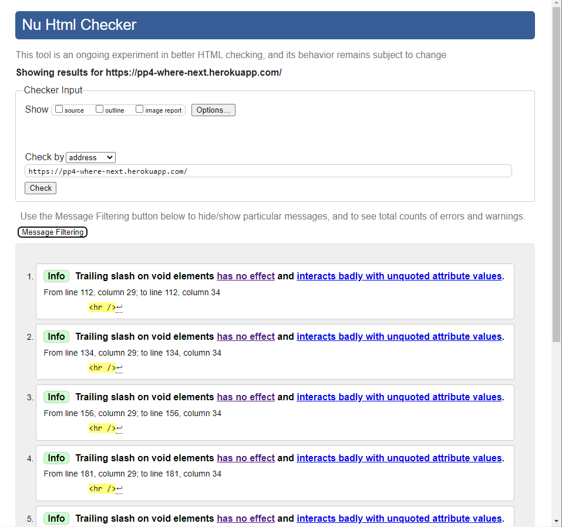
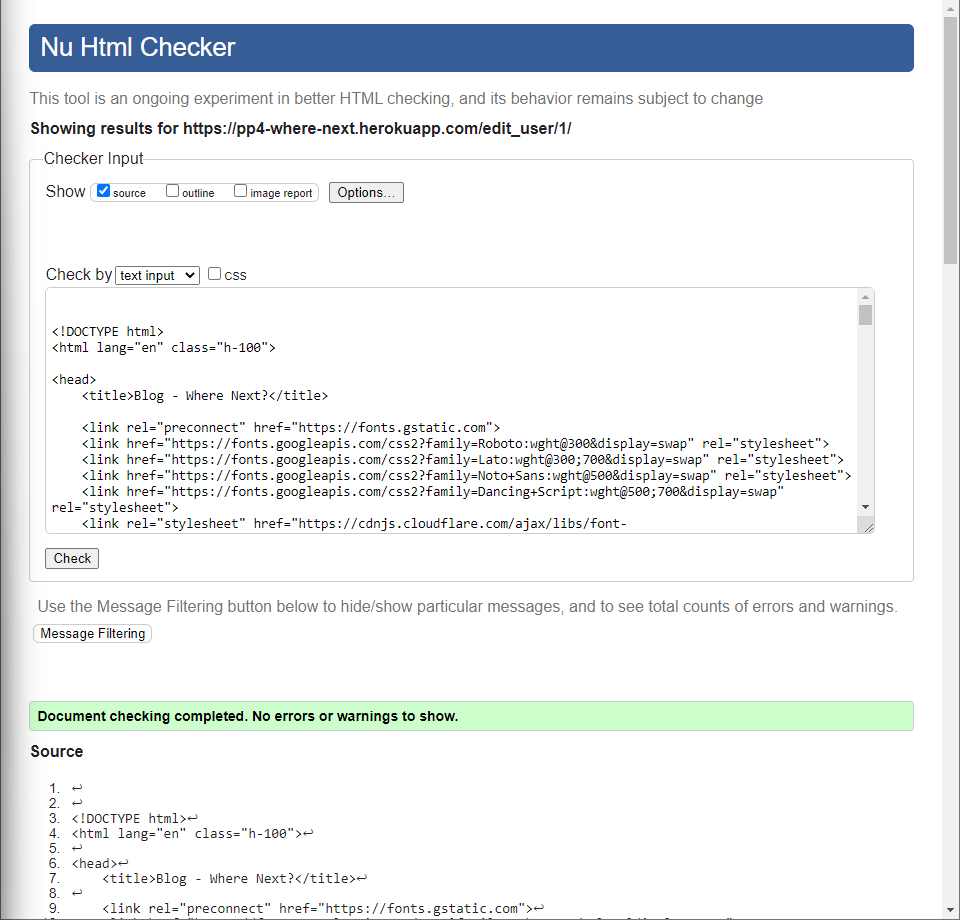

## Testing

Return back to the [README.md](README.md) file.

## Code Validation

### HTML

I have used the recommended [HTML W3C Validator](https://validator.w3.org) to validate all of my HTML files.

As my project uses Jinja syntax, such as ``, ``, and `{{ variable|filter }}`
it will not validate properly if I copy and paste into the HTML validator straight from my source files.

Usually in order to properly validate these types of files, it's recommended to
[validate by uri](https://validator.w3.org/#validate_by_uri) from the deployed Heroku pages.

Unfortunately, nearly all of the pages on this site require a user to be logged-in and authenticated,
and will not work using this method, due to the fact that the HTML Validator (W3C) doesn't have
access to login to the pages.

In order to properly validate my HTML pages with Jinja syntax for authenticated pages, I followed these steps:

- Navigate to the deployed pages which require authentication
- Right-click anywhere on the page, and select **View Page Source** (usually `CTRL+U` or `⌘+U` on Mac).
- This will display the entire "compiled" code, without any Jinja syntax.
- Copy everything, and use the [validate by input](https://validator.w3.org/#validate_by_input) method.
- Repeat this process for every page that requires a user to be logged-in/authenticated.

| Page | W3C URL | Screenshot | Notes |
| --- | --- | --- | --- |
| Home | [W3C](https://validator.w3.org/nu/?doc=https%3A%2F%2Fpp4-where-next.herokuapp.com%2F) |  | Pass: No Errors |
| About | [W3C](https://validator.w3.org/nu/?doc=https%3A%2F%2Fpp4-where-next.herokuapp.com%2Fabout%2F) |  | Pass: No Errors |
| Log In | [W3C](https://validator.w3.org/nu/?doc=https%3A%2F%2Ftribe.herokuapp.com%2Faccounts%2Flogin%2F) |  | Pass: No Errors |
| About | [W3C](https://validator.w3.org/nu/?doc=https%3A%2F%2Ftribe.herokuapp.com%2Faccounts%2Fpassword%2Freset%2F) |  | Pass: No Errors |
| Bucket List | n/a |  | Pass: No Errors |
| Edit User | n/a |  | Pass: No Errors |
| Blog Content | n/a |  | Pass: No Errors |
| Messaging Thread | n/a |  | Pass: No Errors |
| Bucket List | n/a |  | Pass: No Errors |
| Add Item | n/a |  | Pass: No Errors |
| Edit Item| n/a |  | Pass: No Errors |
| Add Plan | n/a |  | Pass: No Errors |
| Edit Plan | n/a |  | Pass: No Errors |
| Individual Post | n/a |  | Pass: No Errors |
| Delete Bucket List item | n/a |  | Pass: No Errors ||
| Sign Out | [W3C](https://validator.w3.org/nu/?doc=https%3A%2F%2Fpp4-where-next.herokuapp.com%2Faccounts%2Flogout%2F) |  | Pass: No Errors |

### PEP8

- [PEP8CI](https://pep8ci.herokuapp.com/) - This was used test the code. No errors where found in the code. 

| File | folder/app | Screenshot | Notes |
| --- | --- | --- | --- |
| admin.py | Bucketlist |  | No errors found |
| apps.py | Bucketlist |  | No errors found |
| forms.py | Bucketlist |  | No errors found |
| models.py | Bucketlist |  | No errors found |
| urls.py | Bucketlist |  | No errors found |
| views.py | Bucketlist |  | No errors found |
| admin.py | Travelblog |  | No errors found |
| apps.py | Travelblog |  | No errors found |
| models.py | Travelblog |  | No errors found |
| urls.py | Travelblog |  | No errors found |
| views.py | Travelblog |  | No errors found |
| settings.py | wherenext |  | No errors found |
| urls.py | wherenext |  | No errors found |
| wsgi.py | wherenext |  | No errors found |

### Manual Testing

Please find manual testing file here: [TESTING.md](/TESTING.md)

### Bugs/known issues